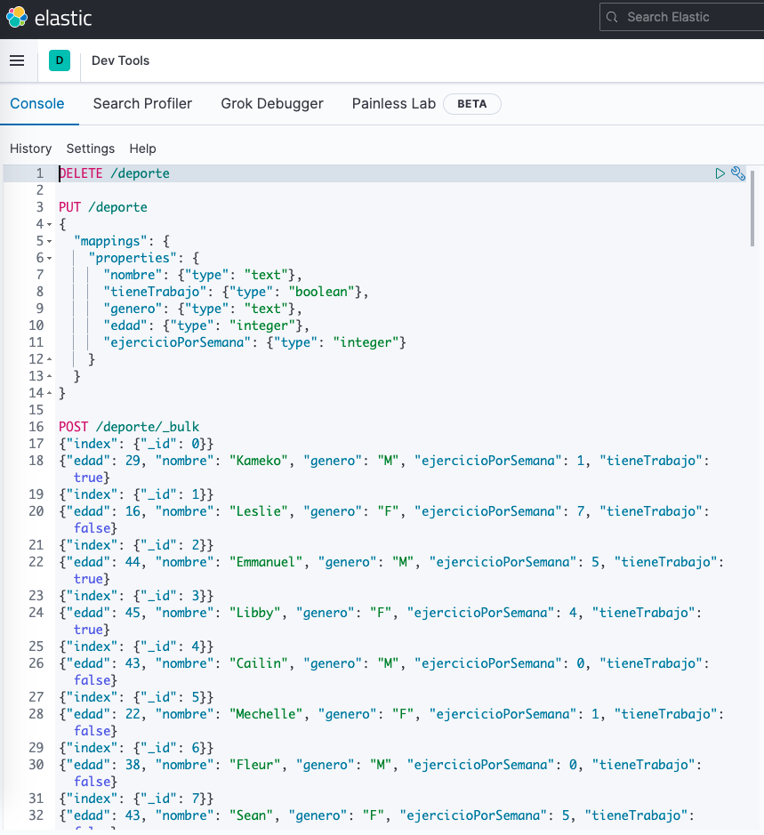
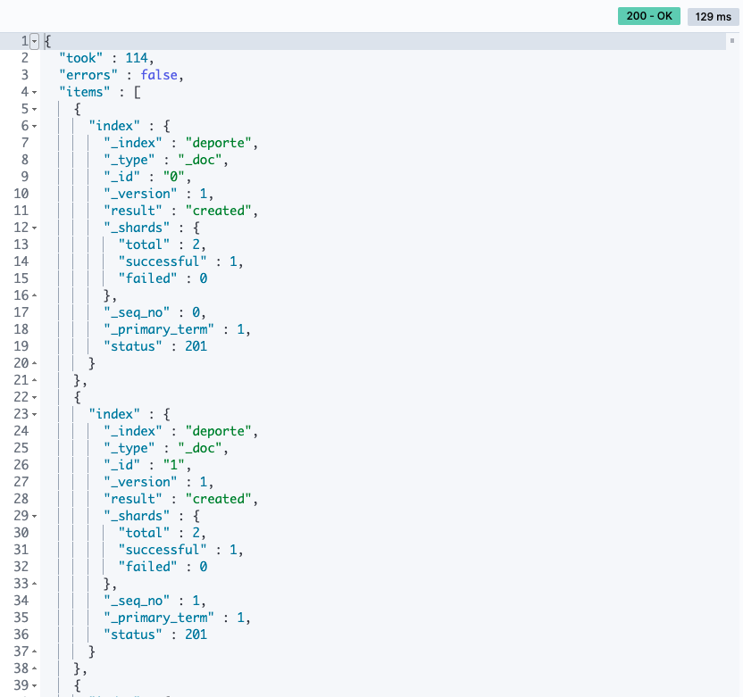
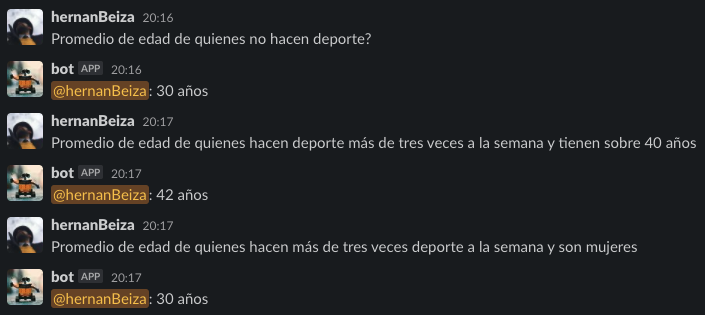

# Trabajo Final Módulo 6

### Integrantes

- Hernán Beiza

- Daniel Morales
- Alexander Sanhueza
- Michell Lobo
- Miguel Vera

## URL Repo

- Rama main
- https://github.com/michellobo/hubotPrueba

#### Creación de índices

#### Creación de índices

#### Resultado de ejecución script de carga de datos

#### Dashboard

#### Slack

